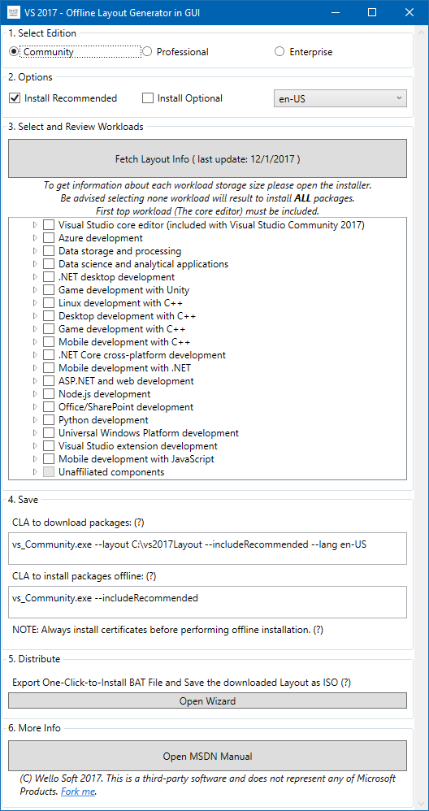
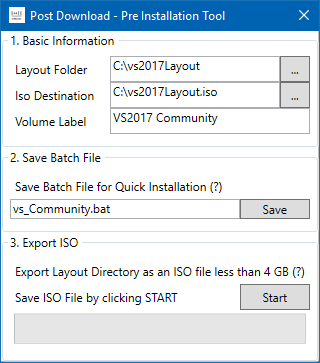
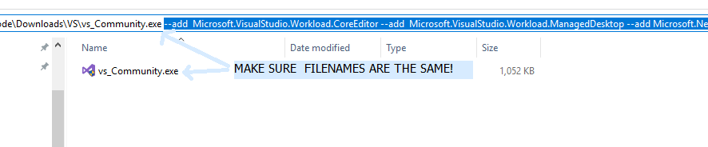

# Vs2017-LayoutInGUI

This software generate arguments for downloading Visual Studio for offline Usage. Suitable for those who don't familiar with CLI (Command Line Interface).

## Instruction

> Instruction below may inaccurate. Always adhere to [MSDN Manual][officialmanual] first.

In order:

1. [Download][medown] and Run the software
2. Select the edition
3. Set options (recommended/optional and language)
4. (Optional) Fetch the updated workload data.
5. Choose (and review) selected workloads and component.
6. Download the [stub installer][installer]. Run with the provided download arguments from this software.
7. CLI will appear. Wait until all component downloaded.
8. Open wizard (see distribute section). This will open a new window.

9. Check the paths, change if necessary.
10. `Save` the batch file. You'll use this as the starting point of VS 2017 installation.
11. After the save button, you'll see a confirmation. Click `Yes` to execute the batchfile. Next step you just need to follow the instruction.
12. (Optional) if you want to keep the layout file for future, hit the `Start` button to save it as an ISO file. Wait until it gets completed.

## Additional Notes

> To run the installation with arguments:

> CLI (Command line Interface) will appear when downloading layouts, but will show normal GUI during offline installation.

> Before installation begin VS will show you list of workloads, even when you're offline. Following instruction above you only need to skip it (as cached layouts is already selected via arguments).

> If a component are missing from downloaded layout, it'll redownloaded automatically at install. If you're on metered network you can turn off the internet during install to prevent it. The installation still can continue anyway (with prompts).

## How it works

This software fetch list of workload and component IDs from [GitHub mirror][workloadsgit] of their [List of Workloads][workloadsdoc] in their documentation. This is necessary because you will always get updated list of workloads, and I don't know other way to do it. 

If Microsoft changes or move their documentation layout or path, there will be chance that this application fail to parse, or even crash. If this happen, tell me.

This software always cache the downloaded package, so you don't have to spam the Github servers that kindly serve their docs to make this software possible.

## Disclaimer

This is a third-party software and does not represent any Microsoft Products.

License: [MIT](LICENSE)

> THE SOFTWARE IS PROVIDED "AS IS", WITHOUT WARRANTY OF ANY KIND, EXPRESS OR IMPLIED, INCLUDING BUT NOT LIMITED TO THE WARRANTIES OF MERCHANTABILITY,FITNESS FOR A PARTICULAR PURPOSE AND NONINFRINGEMENT. IN NO EVENT SHALL THE AUTHORS OR COPYRIGHT HOLDERS BE LIABLE FOR ANY CLAIM, DAMAGES OR OTHER LIABILITY, WHETHER IN AN ACTION OF CONTRACT, TORT OR OTHERWISE, ARISING FROM, OUT OF OR IN CONNECTION WITH THE SOFTWARE OR THE USE OR OTHER DEALINGS IN THE SOFTWARE.

[medown]: https://github.com/willnode/Vs2017-LayoutInGUI/releases
[installer]: https://docs.microsoft.com/en-us/visualstudio/install/install-vs-inconsistent-quality-network#step-1---download-the-visual-studio-bootstrapper
[officialmanual]: https://docs.microsoft.com/en-us/visualstudio/install/install-vs-inconsistent-quality-network
[workloadsdoc]: https://docs.microsoft.com/en-us/visualstudio/install/workload-and-component-ids
[workloadsgit]: https://github.com/MicrosoftDocs/visualstudio-docs/blob/master/docs/install/workload-and-component-ids.md
[certificates]: https://docs.microsoft.com/en-us/visualstudio/install/install-certificates-for-visual-studio-offline
